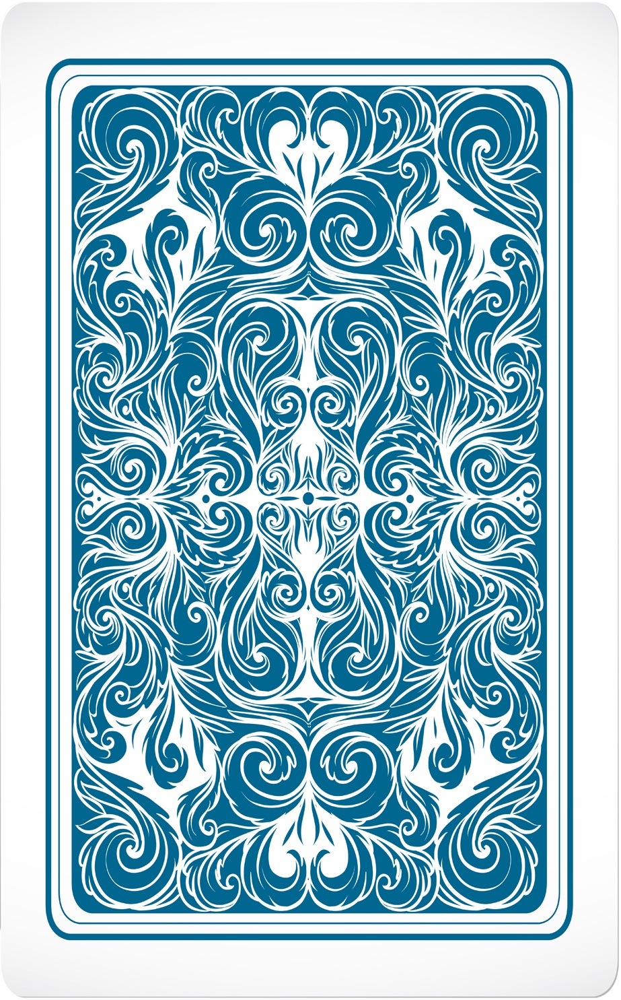

# madoi-tutorial-imageflip

WebSocket通信ライブラリ Madoi のチュートリアルです。
Madoiの機能を使って、カードのめくる動作を共有しています。

```html
<!DOCTYPE html>
<html lang="ja">
<head>
<meta charset="utf8">
<style>
#logDiv {
    overflow: scroll;
    resize: vertical;
    height: 400px;
    border: solid 1px;
    padding: 4;
    border-radius: 4px;
}
</style>
</head>
<body>

<script src="https://fungo.kcg.edu/madoi-20231023/js/madoi.js"></script>
<script>
window.addEventListener("load", ()=>{
	// Madoiを作成しサーバに接続する。引数はルームのID。アプリケーション毎に異なるIDを使用する。
	const m = new madoi.Madoi("imageflip-zlsdmg34i");

	document.getElementById("card").addEventListener("click", e=>{
		m.send("flip", e.target.attributes["data-no"].value);
	});

	m.setHandler("flip", no=>{
		const card = document.querySelector(`img[data-no='${no}']`);
		const state = card.attributes["data-state"].value;
		if(state == "ura"){
			card.attributes["data-state"].value = "omote";
			card.src = "omote.jpg";
		} else{
			card.attributes["data-state"].value = "ura";
			card.src = "ura.jpg";
		}
	});
});
</script>
<a href="https://www.vecteezy.com/free-vector/poker-cards">Poker Cards Vectors by Vecteezy</a>
</body>
</html>
```